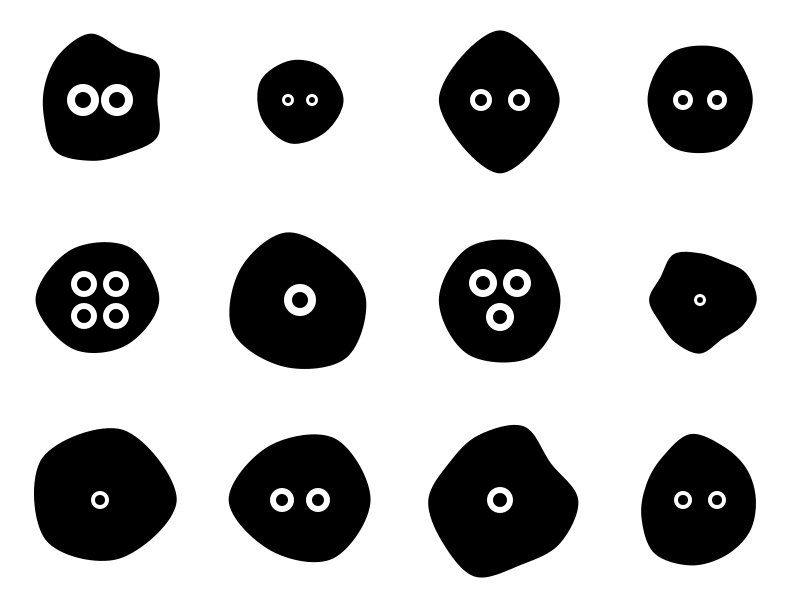

# Generative Art

The repository contains some of my generative art. All art in the repository is generated by Python scripts using [svg.py](https://github.com/orsinium-labs/svg.py).

## Installation

```bash
git clone https://github.com/orsinium-labs/generative-art.git
cd generative-art
python3.9 -m pip isntall svg.py
```

## blobs.py

This is an improved port of the JS code described in [Generative SVG Blob Characters](https://georgefrancis.dev/writing/generative-svg-blob-characters/).

```bash
python3.9 blobs.py --grid-x=4 --grid-y=3 > blobs.svg
```



## circles.py

1. Draw a big invisible circle.
1. Draw a second invisible inner circle with a bit shifted center.
1. Draw a bunch of circles so they are between the two invisible circles and do not intersect.

```bash
python3.9 circles.py > circles.svg
```


