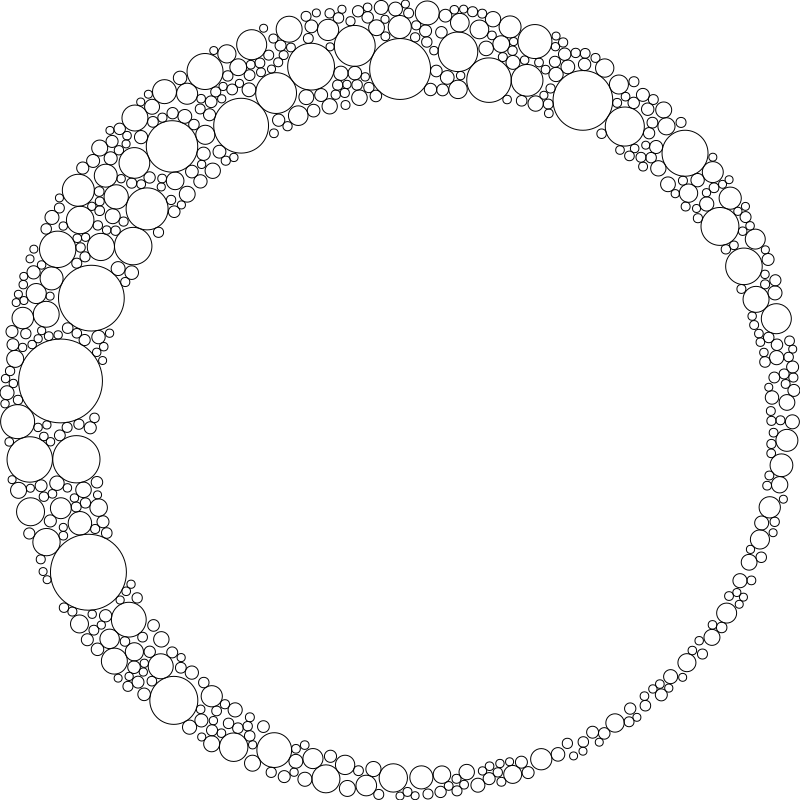

# Generative Art

The repository contains some of my generative art. All art in the repository is generated by Python scripts using [svg.py](https://github.com/orsinium-labs/svg.py).

## Installation

```bash
git clone https://github.com/orsinium-labs/generative-art.git
cd generative-art
python3 -m pip isntall svg.py
```

## blobs.py

This is an improved port of the JS code described in [Generative SVG Blob Characters](https://georgefrancis.dev/writing/generative-svg-blob-characters/).

```bash
python3 blobs.py --grid-x=4 --grid-y=3 > blobs.svg
```


## circles.py

1. Draw a big invisible circle (I draw a white circle, so it can be a background if you use a dark mode).
1. Draw a second invisible inner circle with a bit shifted center.
1. Draw a bunch of circles so they are between the two invisible circles and do not intersect.

```bash
python3 circles.py > circles.svg
```



## illusion.py

An implementation of the famous optical illusion [what color are these spheres](https://www.syfy.com/syfy-wire/another-brain-frying-optical-illusion-what-color-are-these-spheres). The image contains multiple circles of the same color that appear to have a different color. That's because our brain adjust the circle color based on the color of the strip that goes over it.

```bash
python3 illusion.py > illusion.svg
```


## illusion_dots.py

An implementation of the famous optical illusion where dots between black squares appear to change the color between black and white.

```bash
python3 illusion_dots.py > illusion_dots.svg
```


